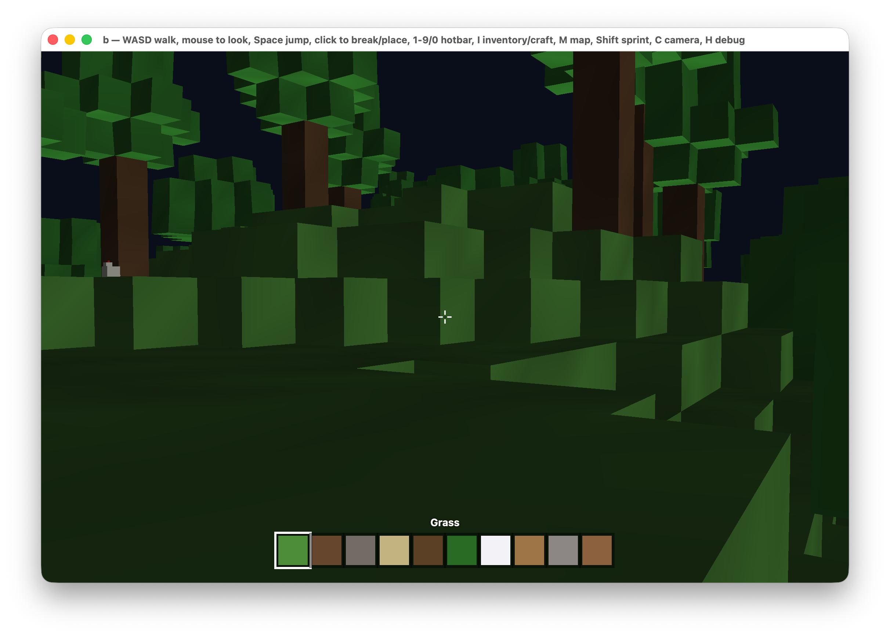

# Metal Renderer

A voxel sandbox game for macOS, built from scratch in Swift using Apple's Metal API for rendering.



## Features

- Procedurally generated voxel terrain with biomes
- Block breaking and placing
- Hotbar, inventory, and crafting system
- Animals and villagers with simple AI
- Village generation
- Survival stats (health/hunger) and game modes
- In-game map, debug overlay, and settings menu
- Gamepad support

## Controls

| Action | Key |
| --- | --- |
| Move | `WASD` |
| Look | Mouse |
| Jump | `Space` |
| Sprint | `Shift` |
| Break / Place block | Click |
| Hotbar slot | `1`-`9`, `0` |
| Inventory / Crafting | `I` |
| Map | `M` |
| Toggle camera | `C` |
| Debug overlay | `H` |

## Requirements

- macOS 13+
- Swift 5.9+ (Xcode command line tools)

## Build & Run

```sh
make run          # debug build
make run-release  # optimized build
```

Or with the Swift toolchain directly:

```sh
swift run
swift run -c release
```

## Project Structure

```
Sources/MetalRenderer/
├── App/         # App entry point and delegate
├── Rendering/   # Metal renderer, shaders, math
├── World/       # Terrain, chunks, villages, animals
├── Player/      # Camera, controls, controller support
├── Items/       # Hotbar, crafting, game modes
└── UI/          # HUD and menus (SwiftUI/AppKit)
```
